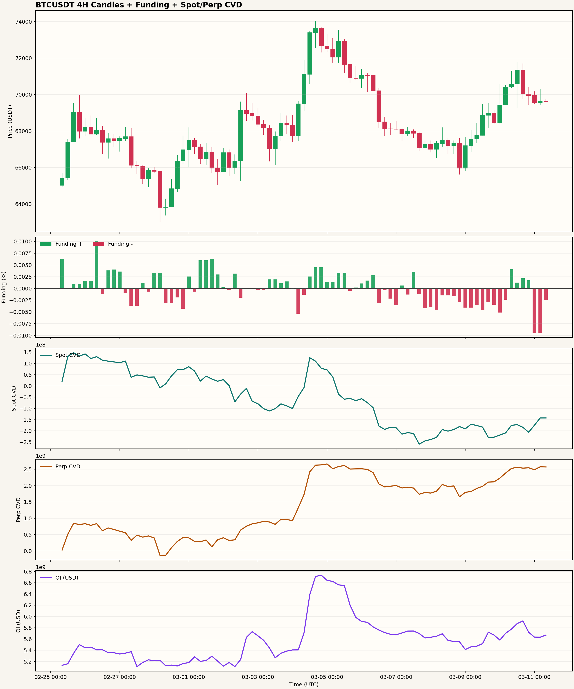

# Funding Rate Telegram Alert (BTCUSDT)

用公開 API 近似交易者平常看盤的方式：
- 多交易所資金費率（Binance + Bybit + OKX）
- OI 可取得時用 OI 權重，否則退化平均
- 4 小時週期（UTC）
- 上方 K 線（綠漲紅跌）
- 下方資金費率柱狀圖（正綠負紅）
- 下方另外分開顯示 現貨(spot) CVD 與 Perp CVD
- 最下方另外顯示 Binance Perp OI
- 可透過 Telegram 發送「文字 + 圖片」

## 專案結構

```text
funding-rate-telegram-alert/
├─ src/
│  └─ funding_alert.py
├─ assets/
│  └─ sample_chart.png
├─ .env.example
├─ .gitignore
├─ requirements.txt
└─ README.md
```

## 安裝

```bash
pip install -r requirements.txt
```

## 設定 Telegram

1. 複製環境檔：

```bash
cp .env.example .env
```

2. 編輯 `.env`：

```env
TELEGRAM_BOT_TOKEN=你的bot token
TELEGRAM_CHAT_ID=你的chat id
```

## 執行

### 一般執行（不通知）

```bash
python3 src/funding_alert.py --out assets/runtime_funding_cvd_4h.png
```

預設會抓最近 14 天的 4H 資料，整合：
- 4H K線
- 多交易所 Funding
- Binance Spot CVD
- Binance Perp CVD
- Binance Perp OI

### 啟用通知（每次執行都送）

判讀重點：
- Funding 過高正值：代表偏多擁擠，可留意做空門檻
- Funding 過低負值：代表偏空擁擠，可留意做多門檻
- Spot / Perp CVD 可輔助觀察現貨與合約是否同步，或是否出現背離，可藉此判斷上漲/下跌是基於哪方力量
- OI 可輔助觀察槓桿倉位是否同步擴張或收縮

```bash
python3 src/funding_alert.py --notify --out assets/runtime_funding_cvd_4h.png
```

### 指定日期區間（UTC）

```bash
python3 src/funding_alert.py --start 2026-03-04 --end 2026-03-11 --out assets/runtime_funding_cvd_4h.png
```

## Cron 每 4 小時執行一次（UTC）

```cron
CRON_TZ=UTC
0 */4 * * * /usr/bin/python3 /path/to/funding-rate-telegram-alert/src/funding_alert.py --notify --out /path/to/funding-rate-telegram-alert/assets/runtime_funding_cvd_4h.png >> /path/to/funding-rate-telegram-alert/cron.log 2>&1
```

## 實際執行畫面

### 1) 實際產生圖表



### 2) 實際 Telegram 通知訊息（範例）

```text
BTCUSDT Funding + CVD 告警通知
時間(UTC+8): 2026-03-11 18:05
比特幣價格: 69,932.81 USDT
📉 最新綜合 Funding: -0.0094%
🟢 資金費率門檻: 已超過做多門檻
🟢 現貨近4小時 CVD: 走強 (+293.0萬 USDT)
🔴 合約近4小時 CVD: 走弱 (-1.4千萬 USDT)
現貨最新 CVD: +413.9萬 USDT
合約最新 CVD: +8.8億 USDT
📈 OI近4小時變化: 走強 (+2,430.0萬 USDT)
最新 OI: +18.6億 USDT
告警解讀: 現貨偏多、合約偏空，盤面出現背離，留意價格可能重新定價。
```

## 補充說明

- Funding 門檻規則：
  - `> +0.005%`：視為已超過做空門檻
  - `< -0.005%`：視為已超過做多門檻
  - 其餘：未達做多 / 做空門檻
- CVD 目前使用 Binance `4h kline` 內的 `quote volume` 與 `taker buy quote volume` 估算，不是逐筆成交版 CVD。
- OI 目前使用 Binance `openInterestHist` 的 `4h` 歷史資料，單位為 `USD notional`。
