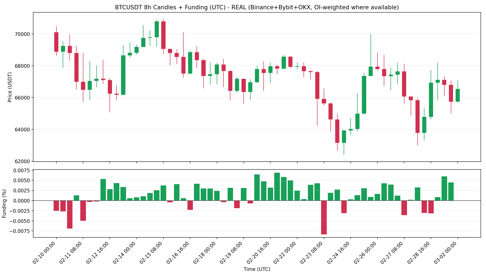

# Funding Rate Telegram Alert (BTCUSDT)

用公開 API 近似 CoinGlass 觀察方式：
- 多交易所資金費率（Binance + Bybit + OKX）
- OI 可取得時用 OI 權重，否則退化平均
- 8 小時週期（UTC）
- 上方 K 線（綠漲紅跌）+ 下方資金費率柱狀圖（正綠負紅）
- 當最新 funding `< 0` 時，透過 Telegram 發送「文字 + 圖片」

## 專案結構

```text
funding-rate-telegram-alert/
├─ src/
│  └─ funding_alert.py
├─ assets/
│  ├─ runtime_real_multi_8h.png
│  └─ run_output.txt
├─ .env.example
├─ .gitignore
├─ requirements.txt
└─ README.md
```

## 安裝

```bash
pip install -r requirements.txt
```

## 設定 Telegram

1. 複製環境檔：

```bash
cp .env.example .env
```

2. 編輯 `.env`：

```env
TELEGRAM_BOT_TOKEN=你的bot token
TELEGRAM_CHAT_ID=你的chat id
```

## 執行

### 一般執行（不通知）

```bash
python3 src/funding_alert.py --out assets/runtime_real_multi_8h.png
```

### 啟用通知（最新 funding < 0 才送）

判讀說明：
- 當資金費率為負時，通常表示市場追空情緒變大。
- 此時做空需要更小心，並可留意可能的反彈與做多機會。

```bash
python3 src/funding_alert.py --notify --out assets/runtime_real_multi_8h.png
```

## Cron 每 8 小時執行一次（UTC）

```cron
CRON_TZ=UTC
0 */8 * * * /usr/bin/python3 /path/to/funding-rate-telegram-alert/src/funding_alert.py --notify --out /path/to/funding-rate-telegram-alert/assets/runtime_real_multi_8h.png >> /path/to/funding-rate-telegram-alert/cron.log 2>&1
```

## 實際執行畫面

### 1) 實際產生圖表



### 2) 實際 Telegram 通知訊息（範例）

```text
⚠️ BTCUSDT 資金費率警報
🔻 目前資金費率為負，請留意市場偏空壓力與倉位風險。
🧠 交易邏輯：追空情緒升溫，做空需更謹慎，可留意反彈做多機會。
🕒 時間 (UTC): 2026-03-02 00:00
💸 資金費率: -0.00000036 (-0.00004%)

📊 BTCUSDT 資金費率圖表（8 小時）
```
